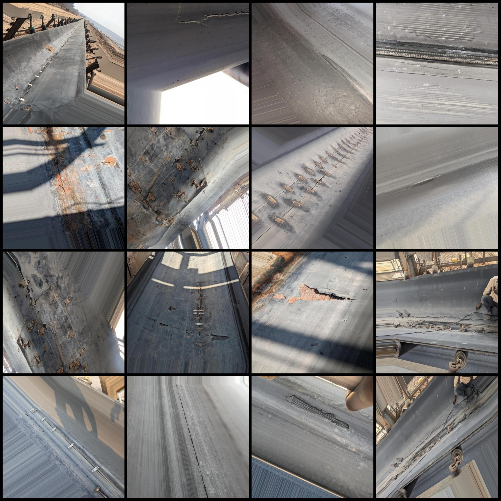
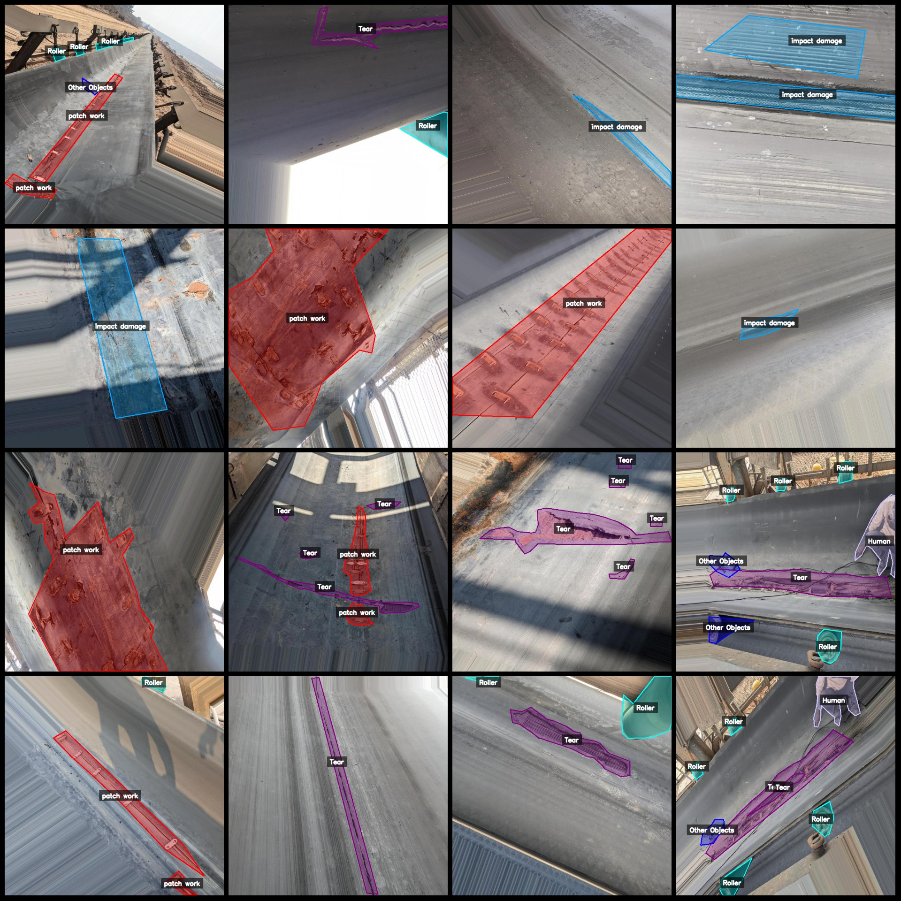
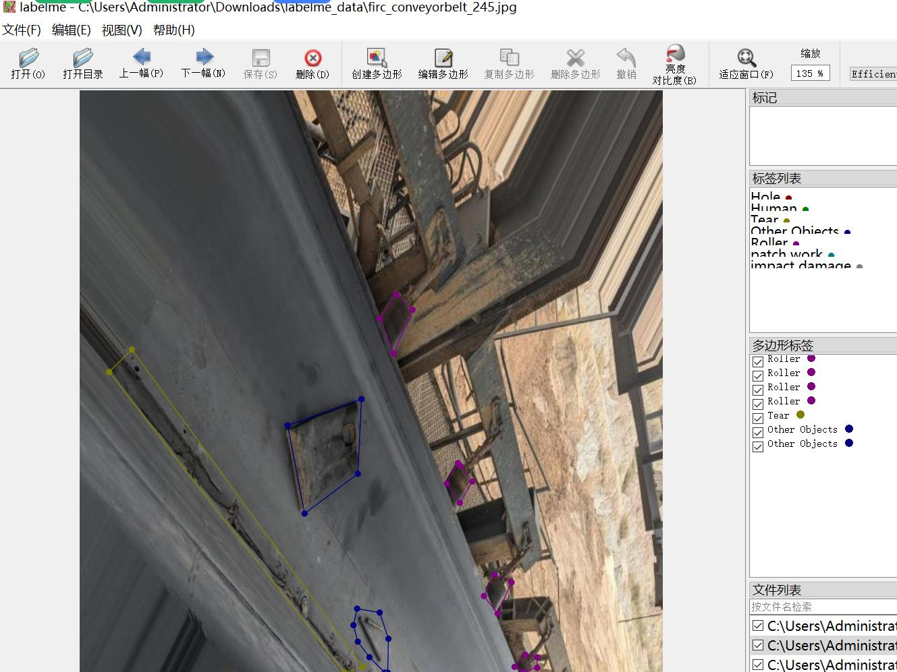

# Transfer belt damage identification and segmentation dataset in labelme format, 918 images in 8 categories

Dataset format: labelme format (without mask files, only containing jpg images and corresponding json files)
Number of images (number of jpg files): 918
Number of annotations (json file number): 918
Number of annotation categories: 8
Annotation categories: ["Hole", "Tear", "Roller", "impact damage", "patch work", "Human", "Other Objects", "Puncture"]
Number of boxes per category:
- Hole (holes) count = 42
- Tear (tears) count = 691
- Roller (rollers) count = 681
- Impact damage (impact damages) count = 283
- Patch work (patches) count = 405
- Human (humans) count = 118
- Other Objects (other objects) count = 130
- Puncture (punctures) count = 120
Total boxes: 2470

Used annotation tool: labelme=5.5.0
Image resolution: 640x640
Annotation rules: Polygons are drawn around the categories
Important note: The dataset can be opened and edited using labelme, but the json dataset needs to be converted into either mask or yolo format for instance segmentation or semantic segmentation.
Special notice: This dataset does not guarantee any accuracy of the trained models or weights files.

Image preview:

Annotation examples:
Randomly selected 16 images:
Annotation drawing results:

## Images

Here is a pay link on Stripe ( https://buy.stripe.com/3cs8yP7sY87d0vu9AB ). Please contact me lonlonago@foxmail.com after funding $89, and I will send you a complete data files , thank you!

